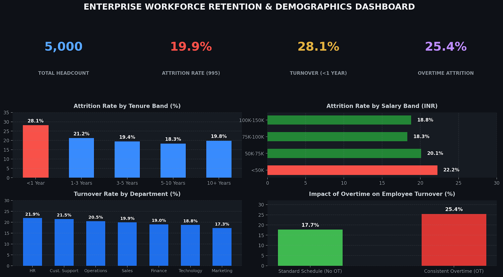

# **Enterprise Workforce Demographics & Retention Analytics**

## 📌 Executive Dashboard Overview


This project analyzes enterprise workforce turnover patterns across 5,000 employee records using **Power BI**, **Power Query**, and **DAX**. It evaluates turnover hotspots across departments, salary bands, and tenure brackets to deliver structured retention recommendations.

---

## 🛠️ Tech Stack & Methodology
* **Business Intelligence:** Microsoft Power BI Desktop
* **Data Transformation:** Power Query (Column profiling, schema shaping, star-schema modeling)
* **Analytical Modeling:** DAX (Data Analysis Expressions)
* **Architecture:** Fact & Dimension Relational Star Schema

---

## 📐 Key DAX Measures

### 1. Attrition Rate
```dax
Attrition Rate = 
DIVIDE(
    CALCULATE(COUNTROWS('employee_workforce_retention_5000'), 'employee_workforce_retention_5000'[Attrition] = "Yes"),
    COUNTROWS('employee_workforce_retention_5000'),
)
` ``` `


### 2. Overtime Turnover %
```dax
Overtime Attrition % = 
DIVIDE(
    CALCULATE(COUNTROWS('employee_workforce_retention_5000'), 'employee_workforce_retention_5000'[Attrition] = "Yes", 'employee_workforce_retention_5000'[Overtime] = "Yes"),
    CALCULATE(COUNTROWS('employee_workforce_retention_5000'), 'employee_workforce_retention_5000'[Overtime] = "Yes"),
    0
)
` ``` `

